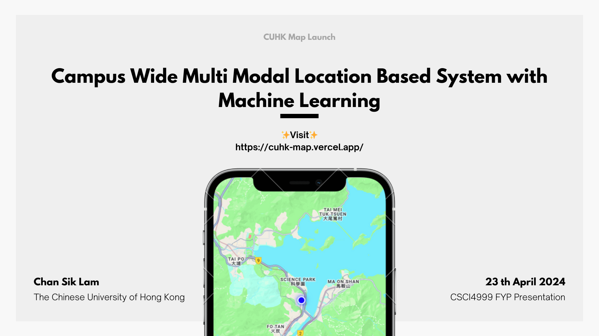
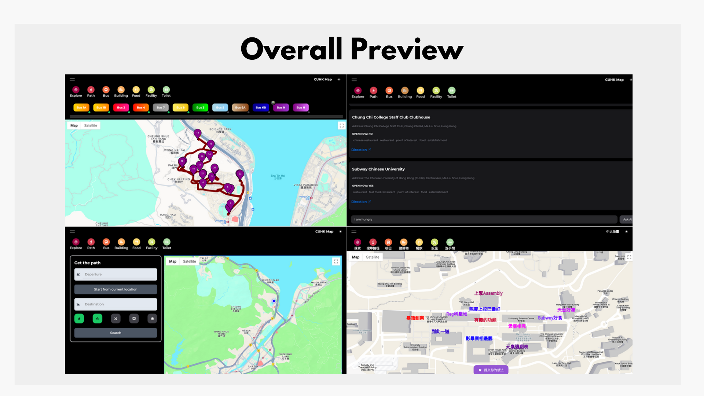
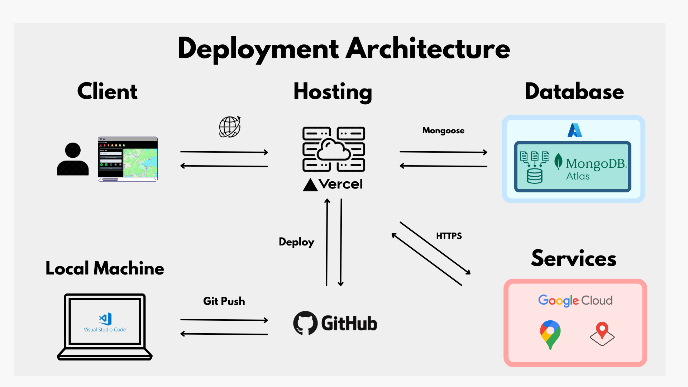
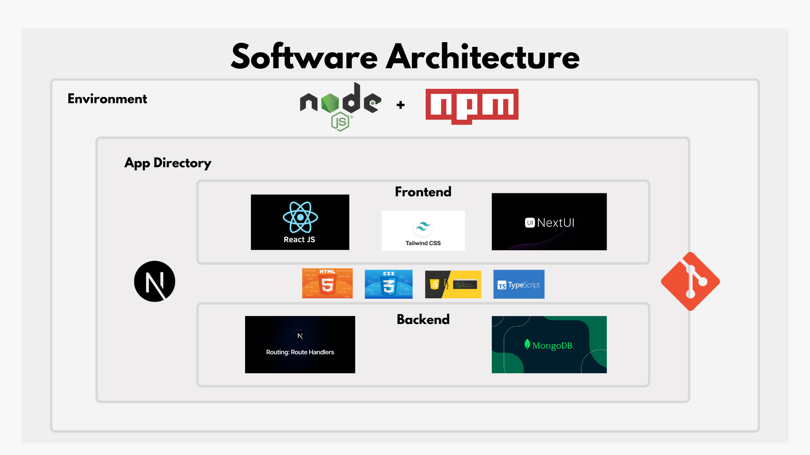
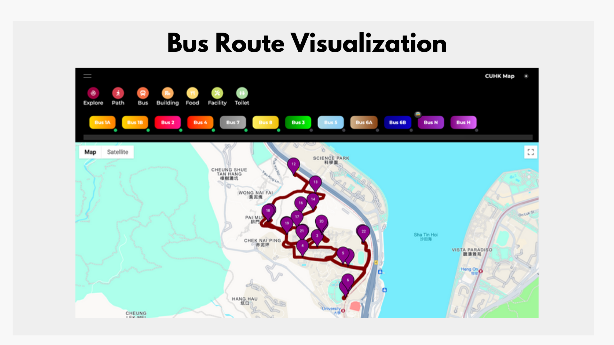

## ✨ Welcome to CUHK Map ✨

	
	
<em>Figure 1: Launch Banner</em>

## Abstract

- Final year project at CUHK
- B.Sc. CompSci 2020-2024
- Checkout https://cuhk-map.vercel.app/

## Introduction

	
	
<em>Figure 2: Four random screenshots</em>

## Background

	
	
<em>Figure 3: Service Architecture Diagram</em>

	
	
<em>Figure 4: Development Tools</em>

	
	
<em>Figure 5: CUHK School Bus Query Service</em>

## Getting Started

1. Clone this repo

2. Run the development server: `npm install & npm run dev`

3. Open [http://localhost:3000](http://localhost:3000) with your browser to see the result.

4. Start editing the page by modifying `app/[locale]/page.tsx`.

## Learn More

- [Next.js](https://nextjs.org/docs)
- [Vercel](https://vercel.com/new?utm_medium=default-template&filter=next.js&utm_source=create-next-app&utm_campaign=create-next-app-readme)
