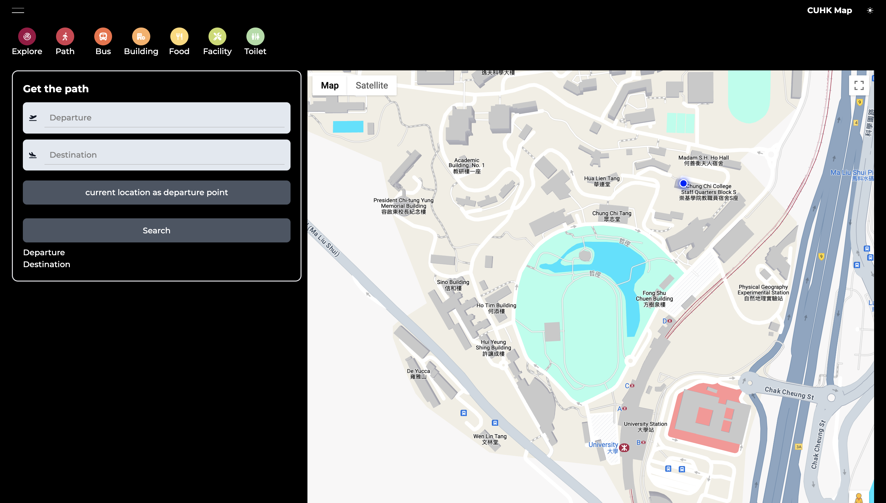

## Current Result

	
	
<em>Figure1: From University Station to Main Campus</em>

## Getting Started

First, run the development server: `npm run dev`

Then, open [http://localhost:3000](http://localhost:3000) with your browser to see the result.

Next, you can start editing the page by modifying `app/page.tsx`. The page auto-updates as you edit the file.

This project uses [`next/font`](https://nextjs.org/docs/basic-features/font-optimization) to automatically optimize and load Inter, a custom Google Font.

## Learn More

To learn more about Next.js, take a look at the following resources:

- [Next.js Documentation](https://nextjs.org/docs) - learn about Next.js features and API.
- [Learn Next.js](https://nextjs.org/learn) - an interactive Next.js tutorial.

You can check out [the Next.js GitHub repository](https://github.com/vercel/next.js/) - your feedback and contributions are welcome!

## Deploy on Vercel

The easiest way to deploy your Next.js app is to use the [Vercel Platform](https://vercel.com/new?utm_medium=default-template&filter=next.js&utm_source=create-next-app&utm_campaign=create-next-app-readme) from the creators of Next.js.

Check out our [Next.js deployment documentation](https://nextjs.org/docs/deployment) for more details.

## Featured Package Used

- Google Map js loader api

  Desc: A package that enable use to load google map api dynamically

  Documentation:

  - GCP: https://developers.google.com/maps/documentation/javascript/examples

  - NPM: https://www.npmjs.com/package/@googlemaps/js-api-loader

  - YouTube: https://www.youtube.com/watch?v=HGfjiNL6JGE&t=997s

- react-geolocated

  Desc: React hook for using Geolocation API by GPS

  Documentation: https://www.npmjs.com/package/react-geolocated

## Deprecated Package

- React Mapbox GL https://github.com/alex3165/react-mapbox-gl

  Desc: A React binding of mapbox-gl-js

  Reason: Feature layer does not render, also mentioned in github issue, but not yet fixed and potential react compatibility issue might occurs during installation

  Alternative: Google Map React Wrapper

- googlemaps/react-wrapper https://developers.google.com/maps/documentation/javascript/react-map?hl=zh-tw

  Desc: A declarative Google Map React component using React, it allows you to render Google Map in your React application

  Reason: js api loader is easier to use, while this react-wrapper has some issue that is hard to fix

- Ref: https://github.com/adrianhajdin/project_travel_advisor
